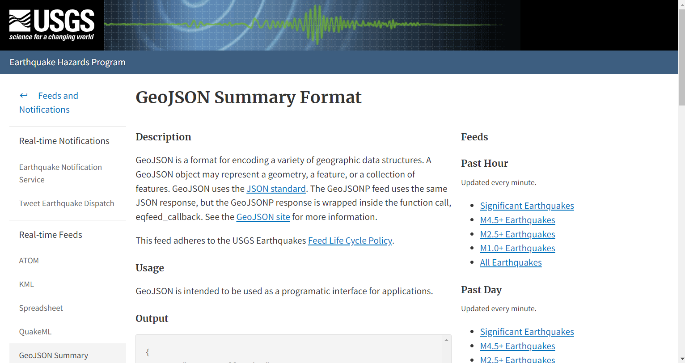
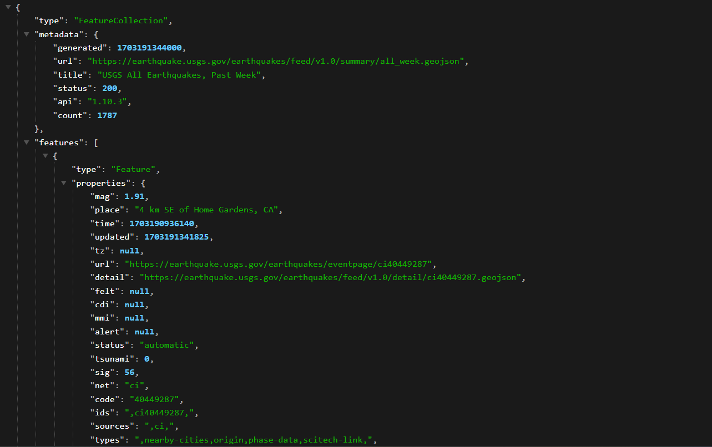

# Earthquake Visualization

## Background

The United States Geological Survey, or USGS for short, is responsible for providing scientific data about natural hazards, the health of our ecosystems and environment, and the impacts of climate and land-use change. Their scientists develop new methods and tools to supply timely, relevant, and useful information about the Earth and its processes.

The USGS is interested in building a new set of tools that will allow them to visualize their earthquake data. They collect a massive amount of data from all over the world each day, but they lack a meaningful way of displaying it. In this challenge, you have been tasked with developing a way to visualize USGS data that will allow them to better educate the public and other government organizations (and hopefully secure more funding) on issues facing our planet.

## Overview of Repository

All files used within this repository are found in the Earthquake_Visualization folder. This folder includes:

* index.html

* static folder

* images folder

Index.html is html file used to create the interactive map, the static folder contains the css and js files used as scripts to visualize the map within the html file. The images folder contains images used in this readme.

## Creating the Map

The first step in creating the map is to visit the USGS GeoJson feed website and choose which json we wish to visualize. For this visualization, we are using the the json containing earthquake data from the last 7 days. The website will look like the following image:

After visiting this website, we will then choose a json we wish to visualize. As stated before, we are using the the json containing earthquake data from the last 7 days. This will look like the following:

Import and visualize the data by doing the following:
.png
Using Leaflet, create a map that plots all the earthquakes from your dataset based on their longitude and latitude.

Your data markers should reflect the magnitude of the earthquake by their size and the depth of the earthquake by color. Earthquakes with higher magnitudes should appear larger, and earthquakes with greater depth should appear darker in color.

Hint: The depth of the earth can be found as the third coordinate for each earthquake.

Include popups that provide additional information about the earthquake when its associated marker is clicked.

Create a legend that will provide context for your map data.

Your visualization should look something like the following map:

[2-Map.png](Earthquake_Visualization/Images/2-Map.png)

## Resources

**<ins>For Hex Color Codes:<ins>**

https://colorbrewer2.org/

**<ins>USGS GeoJSON Feed:<ins>**

https://earthquake.usgs.gov/earthquakes/feed/v1.0/geojson.php

**<ins>Legend Help:<ins>**

https://stackoverflow.com/questions/38329785/leaflet-legend-not-showing

